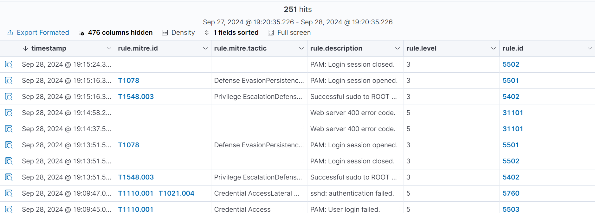

<!-- hide -->
# Configurar y usar wazuh como SIEM

> By [@rosinni](https://github.com/rosinni) and [other contributors](https://github.com/breatheco-de/configure-and-use-wazuh-as-siem/graphs/contributors) at [4Geeks Academy](https://4geeksacademy.co/)

[](https://4geeks.com)
[](https://twitter.com/4geeksacademy)

*Estas instrucciones estan [disponibles en español](https://github.com/breatheco-de/configure-and-use-wazuh-as-siem/blob/main/README.es.md)*

### Antes de empezar...

> ¡Te necesitamos! Estos ejercicios se crean y mantienen en colaboración con personas como tú. Si encuentras algún error o falta de ortografía, contribuye y/o repórtalo.
<!-- endhide -->

<!-- howtostart -->

## 🌱 ¿Cómo empezar este proyecto?

A través de este ejercicio recolectaremos y analizaremos eventos de seguridad desde un endpoint Linux [maquina debian con wordpress](https://4geeks.com/es/interactive-coding-tutorial/desplegando-sitio-wordpress-debian), monitoreando accesos, cambios en archivos y simulando posibles ataques. Utilizaremos las capacidades de Wazuh como SIEM para gestionar estos eventos.

> ⚠ En caso de que no tengas dispobible puedes la **maquina debian con wordpress**, puedes descargar esta [imagen .ova](https://storage.googleapis.com/breathecode/virtualbox/debian-with-wordpress.ova) con una maquina debian configurada con wordpress.

```bash
username: debian
password: 123456
```

<!-- endhowtostart -->

## 📝 Instrucciones


### Agregar Múltiples Fuentes de Datos a Wazuh
Como un SIEM, Wazuh recopila y analiza datos de diversas fuentes, como servidores, aplicaciones, firewalls, routers, y más. El primer paso es asegurarse de que Wazuh esté configurado para recibir logs de estas diversas fuentes.

- [ ] **Fuente 1: Agentes de Wazuh (Endpoints)**
Si ya tienes agentes de Wazuh instalados en tus endpoints [como en el ejercicio EDR](#), esos datos son una de las fuentes. Asegúrate de que los agentes estén activos y enviando datos al Wazuh Manager, sino lo tienes haz la instalación de los agentes en la `maquina debian con wordpress`.

- [ ] **Fuente 2: Logs de Aplicaciones**
Configura los agentes de Wazuh para monitorear logs de aplicaciones específicas en los endpoints. Por ejemplo, puedes configurar un agente para recopilar logs de un servidor web o de un servidor de base de datos. Edita el archivo de configuración del agente en cada endpoint para incluir la ubicación de los logs.

Ejemplo, para monitorear los Logs del Servidor Web. En el archivo de configuración del agente (/var/ossec/etc/ossec.conf), agrega la configuración para monitorealos.

```xml
<localfile>
  <log_format>apache</log_format>
  <location>/var/log/apache2/access.log</location>
</localfile> 
<localfile>
  <log_format>apache</log_format>
  <location>/var/log/apache2/error.log</location>
</localfile>
```

Además debido a que WordPress no genera logs de manera predeterminada, habilita la generación de logs para registrar errores y advertencias PHP. Para activar los logs de errores de WordPress, edita el archivo wp-config.php y agrega las siguientes líneas:

```php
define( 'WP_DEBUG', true );
define( 'WP_DEBUG_LOG', true );
define( 'WP_DEBUG_DISPLAY', false );
```

> 💡 Esto generará un archivo de log en /wp-content/debug.log donde se registrarán todos los errores y advertencias de PHP relacionados con WordPress.

- [ ] **Fuente 3: Logs de Firewalls o Routers**
Si tienes acceso a un firewall o router, asegúrate de que los logs relevantes se envíen a Wazuh a través de agentes. Por lo general, esto se puede hacer instalando un agente de Wazuh en la máquina que maneja los logs del firewall o configurando el dispositivo para que envíe logs a través de syslog a una máquina que tenga un agente de Wazuh instalado.

> **NOTA:** Nosotros practicaremos con la fuente 1 y 2.


### Simulación de Ataques Multi-Fuente
Ahora vamos a simular un ataque distribuido en diferentes sistemas.

1. Intenta iniciar sesión con credenciales incorrectas en el endpoint (maquina debian) varias veces.

2. Modifica archivos sensibles en el endpoint para que Wazuh detecte el cambio.

```bash
sudo echo "Simulación de cambio malicioso" >> /etc/passwd
```

3. Simula los Logs de Apache de acceso y errores. Genera actividad accediendo al sitio web de WordPress e intenta acceder a una página inexistente para generar un error 404 y verificar que se registra en el log de Apache.


### Monitorea en el Dashboard

1. Ve al dashboard y observa los eventos en `Threat Hunting`. Busca la correlación de eventos que involucren los intentos de acceso fallido, los escaneos de puertos desde otra máquina y las modificaciones de archivos en los endpoints. Wazuh debería generar alertas a medida que correlaciona los eventos de estas múltiples fuentes.

Los resultados obtenidos deben ser algo similar esto, alli vas a poder ver todas las simulaciones realizadas. Ejmplo: T1078 que seria el uso indebido de credenciales, T1548.003, que indica un sudo exitoso a ROOT y múltiples errores 400 de Apache, lo cual pueden ser resultado de intentos fallidos de acceder a recursos del servidor web.



2. Ve a la sección de Reports de Wazuh y genera un informe que muestre todos los eventos y alertas recientes. Filtra los eventos por tipo y fuente para ver las correlaciones y anomalías detectadas.

> ⚠ Si los eventos no aparecen de inmediato, revisa la configuración de recolección de logs en los agentes y asegúrate de que todas las fuentes (como los logs de aplicaciones y dispositivos) estén correctamente conectadas y enviando datos al Wazuh Manager.


## Colaboradores

Gracias a estas personas maravillosas ([emoji key](https://github.com/kentcdodds/all-contributors#emoji-key)):

1. [Rosinni Rodriguez (rosinni)](https://github.com/rosinni) contribution: (build-tutorial) ✅, (documentation) 📖
  
2. [Alejandro Sanchez (alesanchezr)](https://github.com/alesanchezr),  contribution: (bug reports) 🐛

Este proyecto sigue la especificación [all-contributors](https://github.com/kentcdodds/all-contributors). ¡Todas las contribuciones son bienvenidas!

Este y otros ejercicios son usados para [aprender a programar](https://4geeksacademy.com/es/aprender-a-programar/aprender-a-programar-desde-cero) por parte de los alumnos de 4Geeks Academy [Coding Bootcamp](https://4geeksacademy.com/us/coding-bootcamp) realizado por [Alejandro Sánchez](https://twitter.com/alesanchezr) y muchos otros contribuyentes. Conoce más sobre nuestros [Cursos de Programación](https://4geeksacademy.com/es/curso-de-programacion-desde-cero?lang=es) para convertirte en [Full Stack Developer](https://4geeksacademy.com/es/coding-bootcamps/desarrollador-full-stack/?lang=es), o nuestro [Data Science Bootcamp](https://4geeksacademy.com/es/coding-bootcamps/curso-datascience-machine-learning).Tambien puedes adentrarte al mundo de ciberseguridad con nuestro [Bootcamp de ciberseguridad](https://4geeksacademy.com/es/coding-bootcamps/curso-ciberseguridad).

<!-- endhide -->

